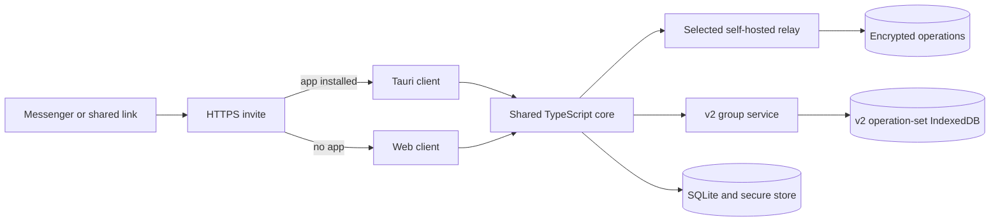
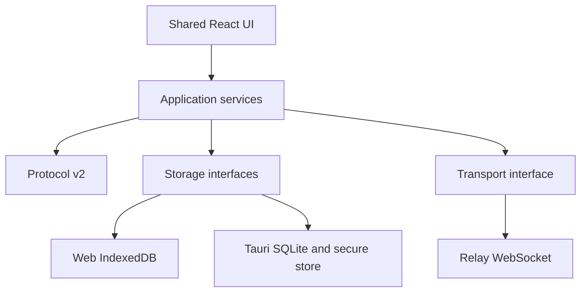
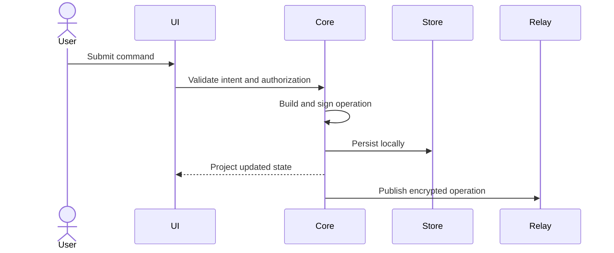

# Architecture

## System context

The HTTPS invite domain routes into the installed app through Universal Links or App Links and falls back to the web join page. It does not have to operate the selected relay.

## Client layers

| Layer | Responsibility |
|---|---|
| React UI | Groups, participants, expenses, balances, settings, and join flows |
| Application services | Commands, projections, authorization decisions, and sync orchestration |
| Protocol | Versioned schemas, canonical encoding, signatures, operation IDs, and validation |
| Platform adapters | Identity storage, ledger storage, link reception, sharing, and lifecycle |
| Transport | WebSocket relay protocol and reconnect behavior |

## Trust boundaries

- Clients trust locally verified signatures and deterministic authorization rules.
- Relays are availability helpers, not authorities.
- Invite landing pages are routing helpers, not membership authorities.
- Imported files, deep links, relay envelopes, and persisted records are untrusted until validated.
- Native secure storage improves secret protection but does not make a compromised device trustworthy.

## Command lifecycle

Local success does not depend on relay availability. Synchronization retries later.
