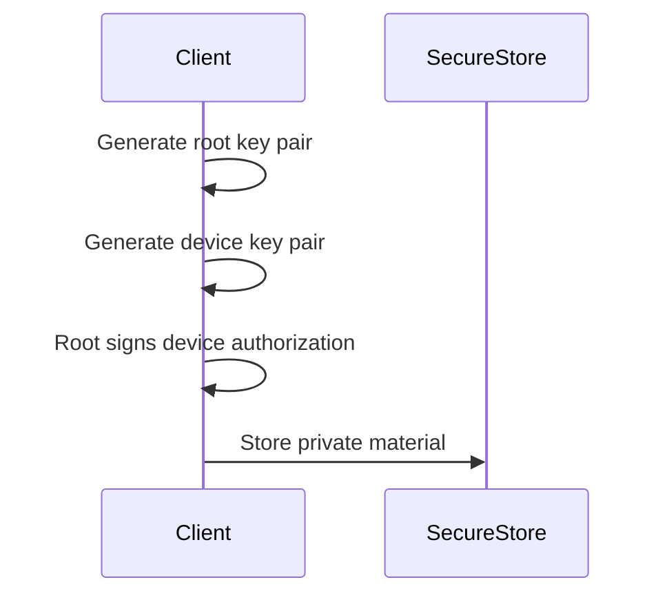
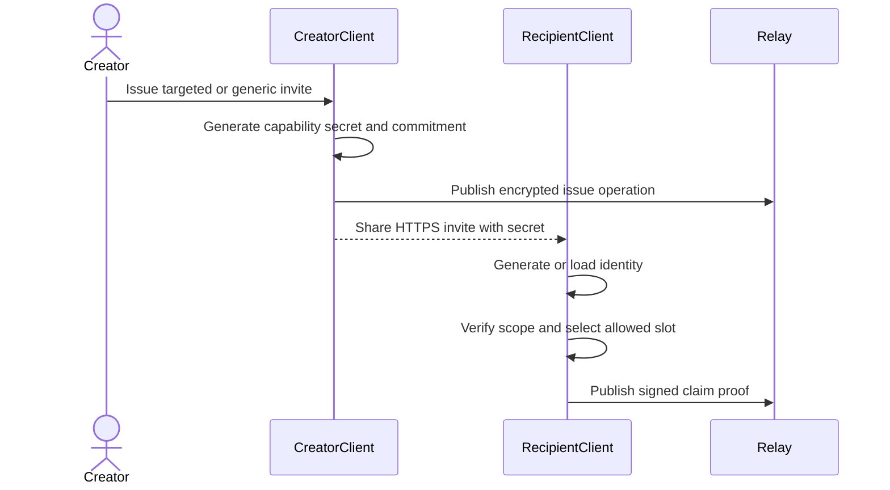

# Cryptographic flows

## Primitives

| Purpose | Primitive |
|---|---|
| Operation signatures | Ed25519 |
| Operation identifiers and commitments | SHA-256 |
| Relay payload encryption | AES-256-GCM |
| Group-key derivation | HKDF-SHA-256 |
| Randomness | Platform cryptographic random source |

Canonical encoding must be versioned and covered by cross-platform test vectors. JSON property order must not implicitly define signed bytes.

## Identity creation

The web adapter uses the strongest browser storage available but must explain its weaker isolation. Tauri uses OS-backed secret storage.

## Operation signing

1. Validate the command and payload.
2. Build unsigned versioned content including parent frontier.
3. Canonically encode it.
4. Hash it into `operationId`.
5. Sign the identifier and group context with the authorized device key.
6. Persist before attempting network publication.

## Targeted participant claim

The private capability secret is not written to relay-readable metadata. Reissuance revokes old active capabilities before issuing another.

## Relay encryption

Each operation is encrypted with a group key and a fresh random nonce. The authenticated context must bind protocol version and opaque group namespace to prevent cross-context substitution.

Each group receives independent random `groupSecret` and `relayGroupCapability` values. Platform storage persists them separately from the signed operation set. They must never be derived from the public group ID. Browser storage provides persistence but weaker isolation; a future Tauri adapter places this material behind native secure storage.

## No social recovery

Protocol v2 has no threshold recovery or root-key rotation ceremony. Device transfer, optional export/import, and creator-authorized participant reassignment are separate flows with separate security meaning.
