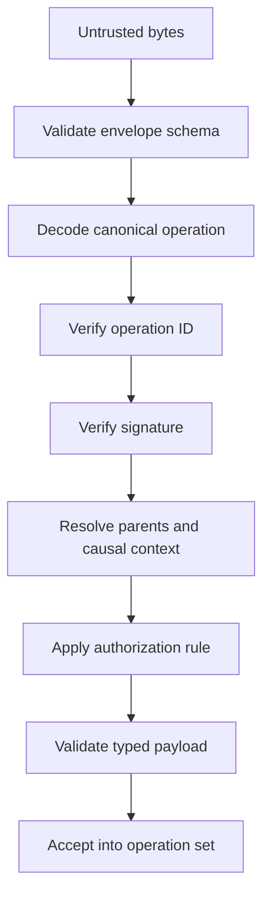

# Operation validation

Validation is deterministic and independent of arrival order.

Failure at any stage rejects the operation without mutating the accepted set.

## Common rules

- Protocol version is supported.
- IDs, keys, clocks, timestamps, parents, and payload satisfy strict schemas.
- Operation ID matches canonical unsigned content.
- Signature is valid for the actor and group context.
- Parent IDs exist, except for the single group-creation root.
- The actor is authorized in the causal state represented by the parents.
- Unknown fields follow the versioning policy; they are not silently trusted.

## Authorization summary

| Operation | Required authority |
|---|---|
| Create/rename/disable slot | Group creator in protocol v2 |
| Issue/revoke claim | Group creator |
| Claim slot | Valid active targeted capability plus claimant signature |
| Reset claimed slot | Explicit creator reset policy; final policy decision pending |
| Create expense | Active claimed participant device |
| Correct/void expense | Explicit expense permission policy; final decision pending |
| Authorize/revoke device | Owning root identity |

## Expense projection

- `ExpenseCorrected` references an existing created expense or accepted correction chain.
- A deterministic winner rule is required for concurrent corrections.
- `ExpenseVoided` tombstones the stable original expense.
- Corrections never mutate or delete earlier operations.
- Balances use only effective, non-voided expense data.

## Set validation

Validation topologically orders operations by parents. Concurrent operations use documented deterministic tie-breaking only where projection semantics require it. Lamport clocks assist ordering but do not prove ancestry.
