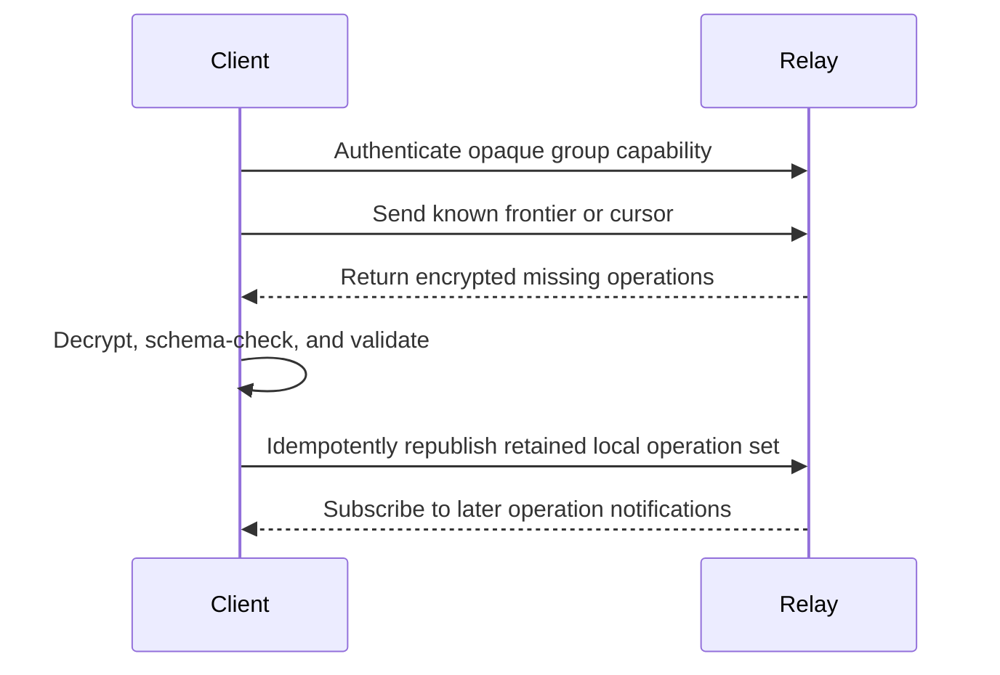

# Synchronization protocol

Synchronization exchanges encrypted, content-addressed operations and converges by set union after local validation.

## Lifecycle

## Requirements

- Publication is idempotent by authenticated operation ID.
- Fetching is paginated and bounded.
- A client may request ancestors required to validate an operation.
- Invalid ciphertext or operations are quarantined or rejected locally.
- Local commands remain available while disconnected.
- Reconnection uses bounded backoff with jitter.
- Relay errors never cause accepted local operations to be deleted.
- Every reconnect performs anti-entropy in both directions: fetch relay operations and idempotently republish locally retained operations.
- A fresh or replaced relay can be rebuilt from any online member whose local history contains the required operations.
- A group remains locally usable with no relay. A relay is needed only when devices need an asynchronous rendezvous point for synchronization.
- When validation is blocked by unavailable ancestors or an empty relay, the client shows that another member with the missing history must come online.

## Convergence

If two honest clients eventually receive the same valid operation set and use the same protocol version, their derived state must match. Property tests must cover arbitrary delivery order, duplication, delay, and concurrent branches.

Relay persistence improves asynchronous availability but is not a correctness dependency. Operation IDs make complete-set republication safe and idempotent. Clients may optimize exchange with cursors, frontiers, or set reconciliation, but an optimization must not eliminate the ability to seed an empty relay from durable local state.

## Group secrets

Possession of a decryption key is not automatically equivalent to operation authority. Encryption controls confidentiality; signatures and projected permissions control writes.

## Version negotiation

Relay envelopes include a transport version. Encrypted operations include a protocol version. Clients must reject unsupported major versions with a clear upgrade error rather than partially applying them.
