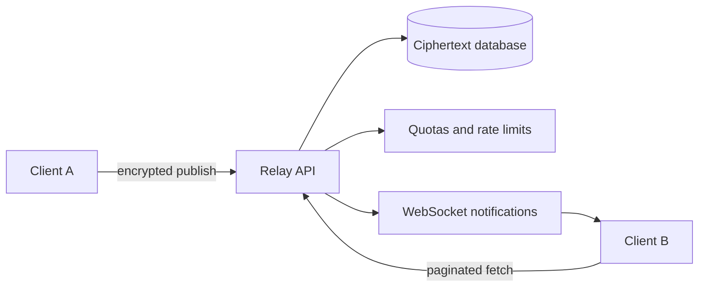

# Relay server

The relay is a self-hostable encrypted rendezvous cache and real-time notification service. It is neither a group authority nor required durable group storage.

## Responsibilities

- Store encrypted operation envelopes.
- Return paginated operations for an opaque group namespace.
- Notify subscribed clients about new envelopes.
- Atomically fetch and delete explicitly disposable namespaces used for encrypted, single-use device handoffs.
- Enforce envelope-size, per-group storage, per-IP connection, idle-connection, pagination, and optional retention limits.
- Expose a health endpoint.
- Expose optional token-authenticated aggregate storage inspection and opaque namespace blocking for operators.
- Support documented backup and upgrade procedures.

## Non-responsibilities

- Reading group contents.
- Holding identity private keys or group decryption keys.
- Deciding membership, balances, or expense validity.
- Owning the canonical truth for invitations.
- Being the only durable copy of group history.

## Stored envelope

The relay stores an opaque group namespace, operation ID, encrypted bytes, protocol envelope version, received timestamp, and only the metadata needed for limits and pagination. It must not use sender-controlled Lamport clocks as the uniqueness key.

## Access control

Reads, writes, and subscriptions require an unguessable group capability or signed scoped request. This reduces arbitrary scraping and quota exhaustion while preserving the relay's inability to understand group state.

The first valid read, subscription, or publish using a previously unknown group ID and capability establishes that opaque namespace. Registration cannot require a publish because clients fetch before republishing local history, and an empty replacement relay must also accept a valid member that currently lacks the missing operations.

This bootstrap rule does not prove that a new namespace belongs to Fair Money. An arbitrary client can create a fresh UUID and capability and upload unrelated opaque bytes. Because encryption prevents content inspection by design, abuse controls must bound resources rather than attempt content moderation. The implementation therefore caps WebSocket frames, individual operations, bytes per group, total stored bytes, namespace count, operation count, connections, idle time, and per-IP namespace/upload rates. It also requires proof of work bound to the group UUID and capability before registering an unknown namespace. This raises anonymous allocation cost without accounts, but does not establish content provenance or defeat distributed attackers.

The implemented v2 WebSocket boundary requires a 32-byte base64url group capability on every publish, read, and subscription message. The first valid authenticated use binds the group UUID to `SHA-256(capability)`; this permits read-before-republication bootstrap while later requests with another capability fail closed. Relay persistence deduplicates by `(group_id, operation_id)` and returns bounded pages ordered by an opaque integer cursor. It stores neither Lamport clocks nor sender public keys. A capability protects an existing namespace from unauthorized access; it does not authorize consumption of an operator's storage by a newly invented namespace.

Disposable handoff namespaces must be explicitly created with a disposable publish. Their capability can atomically fetch and delete the encrypted blob once. Ordinary group namespaces cannot use this destructive operation, and a consumed namespace rejects replay.

The pre-release v1 database is unsupported. Operators delete it before starting v2; no schema migration is provided.

## Deployment

The reference deployment uses Node.js, Hono, WebSockets, and SQLite for a single instance. Horizontal scaling is a later optimization and must preserve the same public protocol. Container images and Compose examples must work without project-operated infrastructure.

The operational contract, reference Compose file, configuration, backup, restore, retention, reverse-proxy, and upgrade procedures are documented in [Self-hosting a relay](../relay-self-hosting.md). Automatic retention remains disabled until reconnect anti-entropy is connected across all groups. After that, any sufficiently complete online member can repopulate an empty or pruned relay.

When administration is explicitly enabled, operators can view namespace identifiers, byte/operation counts, and first/last receipt times. They can delete and denylist an opaque namespace without receiving its ciphertext through the admin API. This is an availability control, not content classification: the operator cannot infer what the encrypted bytes represent, and a blocked group remains locally usable by its members.
