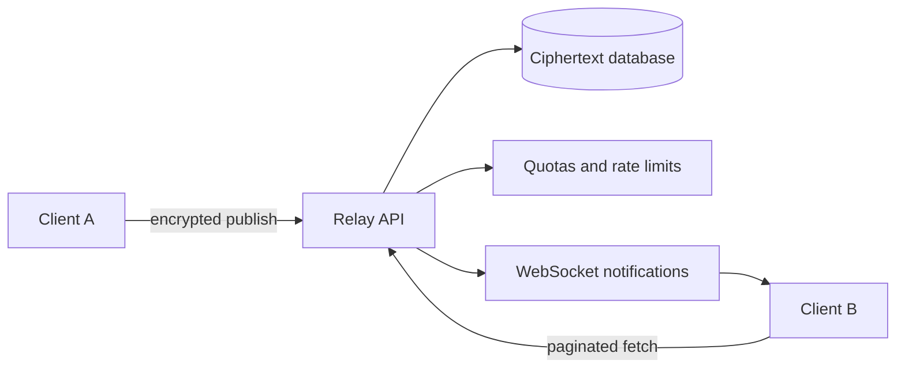

# Relay server

The relay is a self-hostable encrypted rendezvous cache and real-time notification service. It is neither a group authority nor required durable group storage.

## Responsibilities

- Store encrypted operation envelopes.
- Return paginated operations for an opaque group namespace.
- Notify subscribed clients about new envelopes.
- Enforce envelope-size, per-group storage, per-IP connection, idle-connection, pagination, and optional retention limits.
- Expose a health endpoint.
- Support documented backup and upgrade procedures.

## Non-responsibilities

- Reading group contents.
- Holding identity private keys or group decryption keys.
- Deciding membership, balances, or expense validity.
- Owning the canonical truth for invitations.
- Being the only durable copy of group history.

## Stored envelope

The relay stores an opaque group namespace, operation ID, encrypted bytes, protocol envelope version, received timestamp, and only the metadata needed for limits and pagination. It must not use sender-controlled Lamport clocks as the uniqueness key.

## Access control

Reads, writes, and subscriptions require an unguessable group capability or signed scoped request. This reduces arbitrary scraping and quota exhaustion while preserving the relay's inability to understand group state.

The implemented v2 WebSocket boundary requires a 32-byte base64url group capability on every publish, read, and subscription message. The first valid publication binds the group UUID to `SHA-256(capability)`; later requests with another capability fail closed. Relay persistence deduplicates by `(group_id, operation_id)` and returns bounded pages ordered by an opaque integer cursor. It stores neither Lamport clocks nor sender public keys.

The pre-release v1 database is unsupported. Operators delete it before starting v2; no schema migration is provided.

## Deployment

The reference deployment uses Node.js, Hono, WebSockets, and SQLite for a single instance. Horizontal scaling is a later optimization and must preserve the same public protocol. Container images and Compose examples must work without project-operated infrastructure.

The operational contract, reference Compose file, configuration, backup, restore, retention, reverse-proxy, and upgrade procedures are documented in [Self-hosting a relay](../relay-self-hosting.md). Automatic retention remains disabled until reconnect anti-entropy is connected across all groups. After that, any sufficiently complete online member can repopulate an empty or pruned relay.
