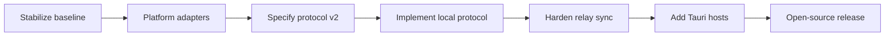

# Implementation roadmap

The detailed checklist and current status live in [the re-architecture plan](14-product-rearchitecture-plan.md). This document summarizes sequencing.

| Phase | Outcome |
|---|---|
| A | Tests, lint, build, documentation, ingress validation, and logging baseline are clean |
| B | Web uses durable IndexedDB and platform-neutral storage/link interfaces |
| C | Canonical protocol-v2 schemas, authorization rules, operation DAG, and vectors are approved |
| D | Participant slots, targeted and generic claims, corrections, and deterministic projections work locally |
| E | Self-hosted relays exchange authenticated opaque operations and concurrent clients converge |
| F | Same React app ships through Tauri with secure storage and Universal/App Links |
| G | License, governance, operator documentation, CI releases, and external security review are ready |

The web client must remain usable at every phase. Tauri and Rust are not prerequisites for correcting the protocol.
