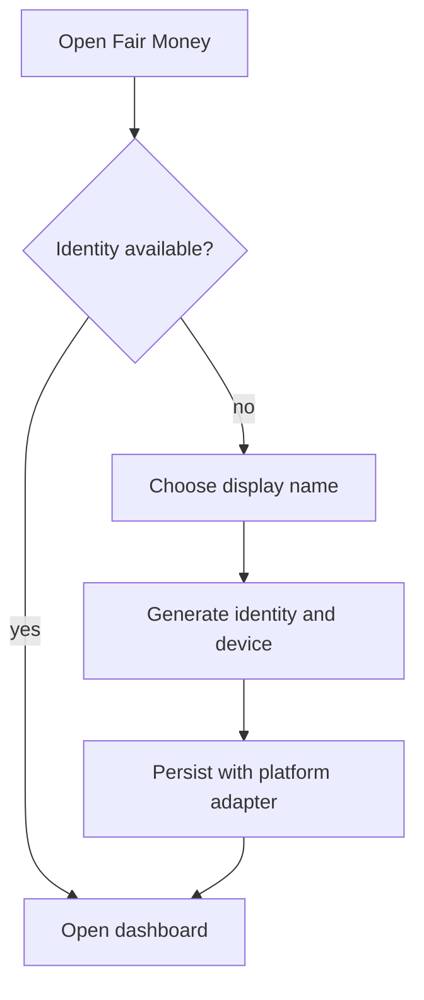

# Identity and key-management UX

Users interact with identities, devices, and participant slots. Raw keys remain an advanced diagnostic detail.

## First run

The web client explains that embedded browsers may isolate identity storage. The native client uses app-owned storage.

## Invite opened

The join screen shows the group, targeted participant name, relay operator, expiry, and whether the current identity is already associated with another slot. Claiming requires explicit confirmation.

If an invite opens in an embedded browser, show actions to open the installed app, install it, copy the code, or continue with a clearly explained browser-local identity.

## Devices

Users can name, add, inspect, and revoke devices. Device enrollment requires proof from the owning root identity or an already approved transfer mechanism. Revocation is an operation and only takes effect for peers that receive it.

## Identity loss

There is no social recovery flow. The UX distinguishes:

- Transfer to another owned device.
- Optional export/import, if retained by product decision.
- Creator-authorized participant-slot reassignment, which creates a new identity binding and does not recover the old key.

Slot reassignment must be visibly auditable and warn that control is being transferred.

## Secret presentation

- Never display private keys during normal use.
- Never put private keys into ordinary QR invitations.
- Require re-authentication where the platform supports it before exporting secrets.
- Avoid screenshots, clipboard use, analytics, and logs around secrets.
