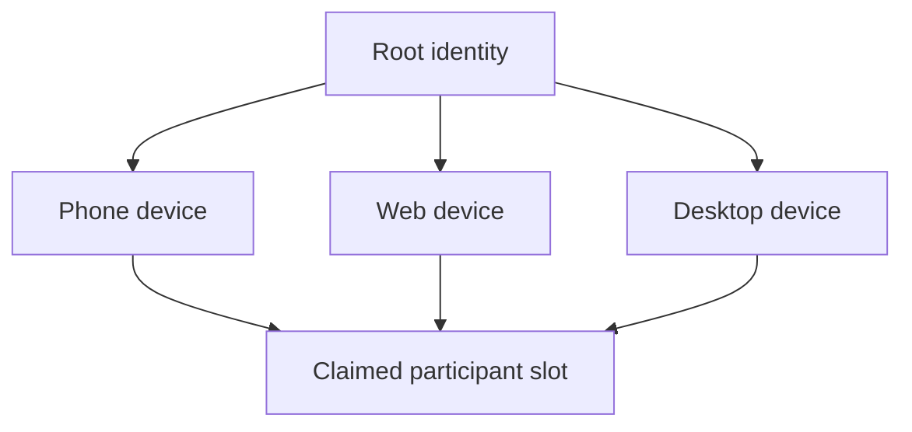
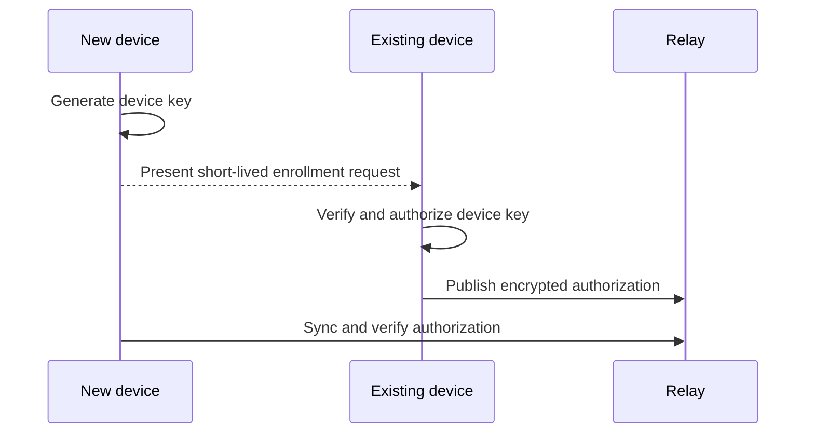

# Multi-device identity

One person may authorize multiple device keys under one root identity. Participant slots bind to the root identity, while ordinary operations are signed by authorized devices.

## Enrollment

Enrollment tokens are short-lived, single-use, and scoped to one identity. They are not participant invitations.

## Revocation

Revocation prevents future operations by that device according to causal authorization rules. It cannot erase operations validly signed before revocation, and an offline peer cannot know about revocation until synchronization.

## Platform behavior

- Web devices store identity material through the web adapter and may be lost when site data is cleared.
- Tauri devices store private material through OS-backed facilities.
- Device names and last-seen information are advisory metadata, not authorization proof.
- No device is automatically trusted because it shares a display name.
