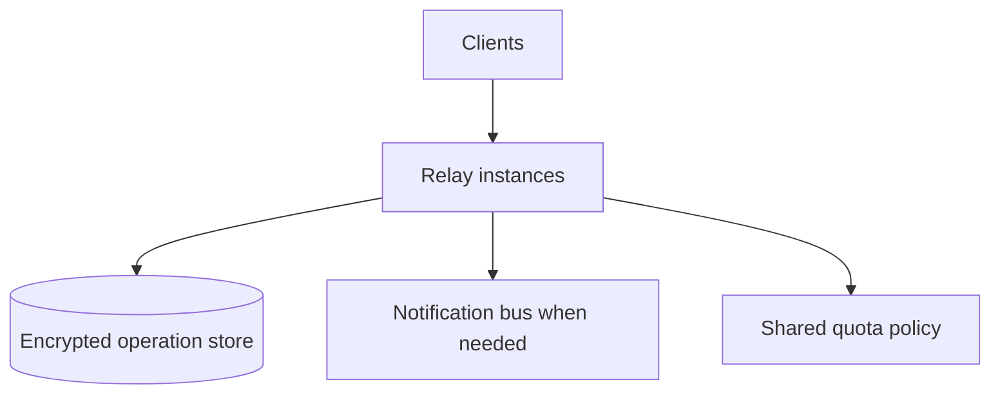

# Scalability and operational limits

Optimize for small groups and self-hostability first. Correctness, bounded resource use, and migration safety matter more than premature distributed infrastructure.

## Client scaling

Projection cost grows with accepted operations. Implement snapshots only as discardable caches validated against operation IDs. Paginate history, virtualize long feeds, and process sync batches incrementally.

Initial test targets:

| Dimension | Baseline target |
|---|---:|
| Active participants per group | 100 |
| Operations per group | 100,000 |
| Encrypted operation size | 64 KiB maximum by default |
| Sync page | 500 operations or bounded bytes |
| Offline concurrent writers | 20 |

These are test targets, not promised service limits.

## Relay scaling

A single SQLite relay is the reference self-hosted deployment. Before horizontal scaling, measure connection count, publish rate, storage growth, page latency, and write contention. A future shared database/pub-sub deployment must preserve protocol behavior and self-hosted compatibility.

## Retention and compaction

Relays may expose configurable retention but must not silently claim durable backup semantics. Clients retain authoritative validated history. Protocol-level compaction requires a separately specified, signed checkpoint mechanism and cannot discard auditability by implementation convenience.
