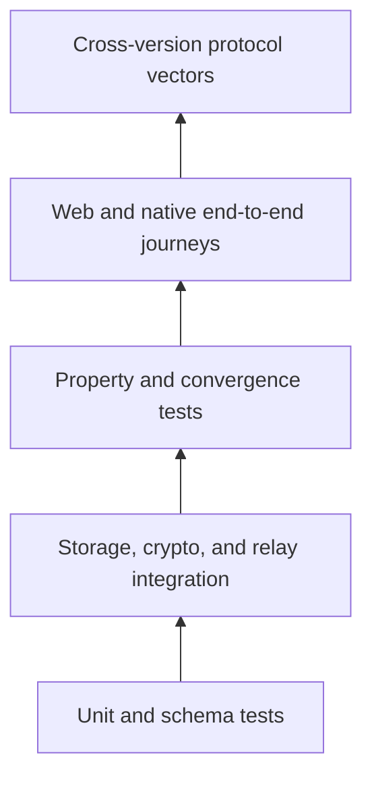

# Testing strategy

## Layers

## Required suites

| Suite | Critical coverage |
|---|---|
| Schemas | Reject malformed, oversized, unknown-version, and ambiguous inputs |
| Crypto vectors | Canonical bytes, hashes, signatures, commitments, encryption failures |
| Authorization | Every operation type, revoked devices, consumed invites, causal edge cases |
| Projections | Balances, corrections, voids, participant claims, deterministic conflicts |
| Property tests | Delivery order, duplication, branches, conservation, convergence |
| Storage contracts | In-memory, IndexedDB, and Tauri SQLite parity |
| Relay | Pagination, idempotency, quotas, reconnects, unauthorized access, persistence |
| Web E2E | Reload, offline use, invite fallback, isolated-browser warning, edits |
| Native E2E | Cold/warm deep links, secure persistence, installed-app routing |

## Compatibility gate

Protocol changes require versioned fixtures that independent implementations can consume. A release cannot change canonical encoding or authorization results without a protocol version decision and migration plan.

## CI gates

Every change should run formatting or diff checks, TypeScript validation, lint, unit/integration/property tests, production builds, and documentation stale-term checks. Relay integration tests need localhost HTTP/WebSocket access.

## Security testing

Test forged signatures, invite theft/replay, guessed group namespaces, malicious relay ordering/omission, ciphertext corruption, dependency failures, log redaction, quota exhaustion, and compromised-device revocation limits.
