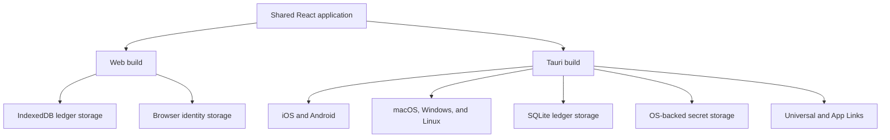
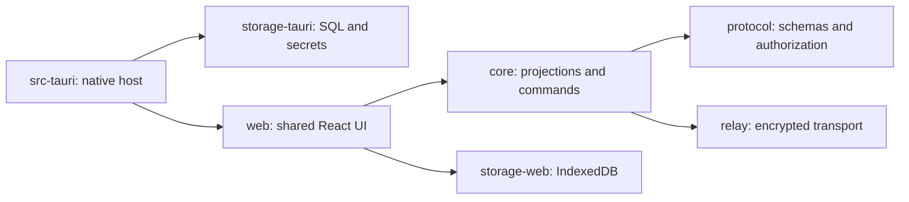

# Fair Money Product and Re-architecture Plan

> Status: approved direction and implementation handoff
>
> Last updated: 2026-07-16

This document is the starting point for future implementation sessions. It supersedes the platform and recovery direction in the older design roadmap where the two conflict. Do not begin by rewriting the React UI or moving all code to Rust. First correct the protocol and introduce platform boundaries; then add Tauri as another host for the same application.

The application has never been deployed to production. Backward compatibility with v1 code, development storage, APIs, or signed history is explicitly not required. Delete superseded implementations and tests as soon as their v2 replacement is connected; do not add or retain migration shims.

## 1. Product goals

Fair Money is intended to be an open-source, privacy-first expense and debt tracker with:

- A fully functional web application.
- Native iOS, Android, and desktop applications built from the same React frontend, preferably with Tauri 2.
- End-to-end encrypted group data.
- Offline operation and later synchronization.
- Relay servers that anybody can self-host.
- Groups whose participants can be created before those people join.
- Both targeted invitations for a specific participant identity/slot and generic invitations whose recipient chooses a currently unclaimed slot.
- A way for the group creator to revoke and reissue a lost invitation for an unclaimed identity.
- Immutable, auditable editing and voiding of expenses/debts.
- No social identity-recovery ceremony.

The product must not require a central account service. A canonical static link domain may be used to support iOS Universal Links, but it must not store invite contents or prevent use of a self-hosted relay.

## 2. Why a native application is needed

Links opened from Messenger, WhatsApp, and similar applications may run inside an embedded iOS browser. That browser can have storage isolated from Safari and from other embedded browsers. Consequently, a web identity stored in `localStorage` or IndexedDB is not reliably available when an invite is opened.

No web framework can make unrelated iOS browser containers share storage. The solution is an installed application with:

- App-owned persistent identity storage.
- iOS Universal Links and Android App Links.
- A normal HTTPS fallback for users without the app.

Tauri does not replace the web application. It packages the existing web frontend and supplies native capabilities.



## 3. Target repository architecture

The eventual package boundaries should be:



This can be reached incrementally. Do not move files merely to match this tree before interfaces and tests exist.

### Required platform interfaces

At minimum, remove direct browser API access from business logic behind these interfaces:

```ts
interface IdentityStore {
  load(): Promise<Identity | null>;
  save(identity: Identity): Promise<void>;
  clear(): Promise<void>;
}

interface LedgerStore {
  append(groupId: GroupId, operation: Operation): Promise<void>;
  get(groupId: GroupId): Promise<Operation[]>;
  deleteLocalGroup(groupId: GroupId): Promise<void>;
}

interface LinkReceiver {
  getInitialUrl(): Promise<string | null>;
  subscribe(handler: (url: string) => void): () => void;
}
```

Browser and Tauri implementations must pass the same contract tests.

## 4. Invitation and deep-link architecture

Use a normal HTTPS link as the canonical invitation:

`https://join.fairmoney.example/invite/<opaque-or-encrypted-token>`

When the application is installed, the operating system opens that URL in Fair Money. Otherwise it opens the web join page.

The join-domain server should be static. The token may contain or resolve encrypted metadata including the selected relay URL. It must not require the canonical Fair Money relay.

Protocol v2 uses `https://join.example/invite/<ciphertext>#key=<decryption-key>`. The path contains AES-256-GCM ciphertext and the fragment contains its random key. URL fragments are not sent in HTTP requests, so the static join host cannot decrypt the relay URL, group secret, participant slot, or claim capability. Applications must preserve the complete URL, including its fragment.

An invite carries an opaque group capability, relay URL, claim capability, expiration, and authentication data. A targeted invite also carries its fixed participant-slot ID. A generic invite carries no fixed slot; after loading current group history, the recipient chooses one still-unclaimed slot and binds the single-use capability to that choice in the signed claim operation.

The landing page must offer:

- Open in Fair Money.
- Install the native application.
- Copy the invitation code.
- Continue in the web application.
- A warning that an embedded browser may have an isolated identity.

A custom scheme such as `fairmoney://invite/...` may be a secondary fallback, not the primary link. HTTPS Universal Links/App Links are domain-verified and provide the correct no-app fallback.

## 5. Participant-slot membership model

The present membership model identifies a member directly by their root public key. It cannot represent people who have not joined. Replace it with stable participant slots.

```ts
interface ParticipantSlot {
  participantId: string;
  displayName: string;
  status: 'unclaimed' | 'claimed' | 'disabled';
  claimedRootPublicKey?: PublicKey;
  createdBy: ParticipantId;
}
```

Expenses reference `participantId`, never a root public key. This allows the creator to add Alice, Bob, and Charlie and enter shared expenses before they install or open the application.

### Claim flow

1. The creator creates an unclaimed participant slot.
2. The creator issues a single-use claim capability for that slot, with optional advisory expiry metadata.
3. The recipient opens the invite in the native or web client.
4. The recipient sees the identity/slot the invite targets.
5. The recipient confirms the choice and binds their locally generated root public key to the slot.
6. The claim capability becomes consumed and cannot be replayed.

For a generic invite, the creator issues a capability with `any-unclaimed-slot` scope. After loading and validating group history, the recipient chooses one currently unclaimed participant slot. The signed claim names that slot. The first valid claim consumes the capability regardless of which slot was selected, and concurrent claims resolve deterministically.

The creator must never generate or retain another participant's private key.

### Lost invite

For an unclaimed slot, the creator can revoke all outstanding claim capabilities and issue another link for the same participant ID.

For an already claimed but lost identity, do not silently “recover” its key. A creator-authorized slot reset/reassignment may be supported as an explicit, auditable administrative action. The UI must warn that this transfers control of that participant slot.

### Authorization decision

Only the group creator should initially be allowed to create participant slots, issue or revoke targeted or generic invites, reset a slot, and remove another participant. This can later become a role/permission system, but the first protocol version should not leave authority implicit.

## 6. Ledger/operation redesign

The existing linear `previousHash` ledger is unsafe for genuinely concurrent offline writers. Two peers can legitimately produce entries with the same parent. Sorting by Lamport clock does not convert those branches into a linear chain.

Replace it with a versioned signed-operation model that explicitly supports concurrency. A signed operation DAG is the current preferred direction; a different CRDT/event structure is acceptable only if it has deterministic replay and documented conflict rules.

Candidate operations:

- `GroupCreated`
- `ParticipantSlotCreated`
- `ParticipantSlotRenamed`
- `ClaimCapabilityIssued`
- `ClaimCapabilityRevoked`
- `ParticipantSlotClaimed`
- `ParticipantSlotReset`
- `ParticipantSlotDisabled`
- `ExpenseCreated`
- `ExpenseCorrected`
- `ExpenseVoided`
- `SettlementCreated`
- `DeviceAuthorized`
- `DeviceRevoked`

Every operation needs:

- Protocol version.
- Globally unique operation ID derived from canonical content.
- Group ID or opaque group namespace.
- Parent/frontier references.
- Lamport clock or equivalent deterministic ordering metadata.
- Actor public key and signature.
- Typed payload validated at the trust boundary.
- Explicit authorization rule.

Do not describe this as a blockchain unless the implementation truly provides blockchain consensus. “Signed, tamper-evident operation history” is more accurate.

## 7. Expense/debt editing

Entries remain immutable. Editing is one `ExpenseCorrection`/`ExpenseCorrected` operation referencing the stable original expense and containing complete replacement data. Voiding is a separate tombstone operation.

The current branch already contains the first vertical slice:

- `GroupManager.correctExpense()` creates one correction operation.
- The React edit form no longer performs void-then-create.
- The expense feed displays effective expenses and hides voided entries.
- Expense cards expose an Edit action.
- Core tests cover the manager correction path.

Current validation baseline:

- 163 core tests pass.
- 11 protocol-v2 relay HTTP/WebSocket integration and configuration tests pass.
- 12 web platform/storage tests pass.
- Full workspace lint passes.
- Full production build passes.
- `better-sqlite3` is upgraded to 12.11.1 for Node 26 compatibility.

The production build still reports a large-chunk warning and mixed static/dynamic loading of `identity-export.ts`; these are non-blocking cleanup items.

Remaining edit work:

- Add localized Edit/Save strings instead of hard-coded English.
- Add permission rules for who may correct an expense.
- Define and test concurrent-correction resolution.
- Show correction history/audit information.
- Add browser-level tests covering edit, sync, reload, and another peer.

## 8. Remove recovery

Remove the social recovery feature rather than building further on it:

- [x] `RecoveryManager`
- [x] Threshold `RootKeyRotation` and recovery co-signature operations
- [x] Recovery UI and routes
- [x] Recovery tests

Do not conflate recovery with portability. A later product decision must distinguish:

- Moving an identity to another owned device.
- Backing up/exporting an identity.
- Administratively reassigning a participant slot after identity loss.

The requested direction removes social group co-signing recovery. Intentional identity transfer, self-authorized root rotation, device enrollment/sharing, device revocation, and identity export/import remain supported portability features and must not be deleted as recovery cleanup.

## 9. Relay requirements

Anybody must be able to host a relay from documented source or container images. Clients must be able to select a relay, and an invite must carry the relay location without exposing plaintext group data.

The relay is untrusted but still must defend its availability:

- Never receive group plaintext or encryption keys.
- Require an opaque group capability or signed request before reads/writes.
- Deduplicate by authenticated operation ID, not `(group, Lamport clock, sender)`.
- Apply message-size, group-size, connection, and rate limits.
- Validate envelope shape before persistence.
- Prevent arbitrary subscription to guessed group IDs.
- Support idempotent publication and pagination.
- Document retention, pruning, backups, observability, and upgrade behavior.
- Provide health/readiness endpoints and Docker Compose examples.

The current REST invite store must not be trusted for authorization: deletion currently relies on a public-key string header rather than a signature. Prefer protocol-level encrypted claim operations/capabilities rather than relay-owned invitation truth.

The pre-release REST invite store, SQLite invite table, unauthenticated deletion route, expiry pruning, and tests have been deleted. Protocol-v2 encrypted invitation packages are created by clients; relays hold no invitation records.

## 10. Security invariants

Future changes must preserve these invariants:

1. Relay operators cannot read group contents.
2. Private identity keys never appear in invite links or relay data.
3. A participant claim capability is scoped to exactly one group and slot.
4. A revoked or consumed capability cannot claim a slot. Wall-clock expiry is advisory because offline peers have no trusted deterministic clock.
5. Reissuing an invite does not change historical participant IDs or balances.
6. All network data is schema-validated before domain processing.
7. All operations are authenticated and authorization is deterministic.
8. A malicious relay can delay or omit operations but cannot forge valid ones.
9. Web and native clients derive identical state from the same valid operation set.
10. Secrets are never written to normal logs.

## 11. Migration phases

### Phase A — Stabilize the existing application

- [x] Keep the atomic expense correction slice.
- [x] Fix the existing lint failures.
- [x] Upgrade `better-sqlite3` and restore relay test execution.
- [x] Add CI for test, build, lint, and relay container smoke tests.
- [x] Remove noisy public-key and protocol logging from active sync and relay paths.
- [x] Add structural schema validation to persisted-ledger and relay sync ingress.
- [x] Rewrite the design and flow documents to protocol v2 terminology and Mermaid-only diagrams.

Exit criterion: clean CI and a reproducible baseline before protocol migration.

### Phase B — Introduce platform adapters

- [x] Extract identity and ledger storage interfaces.
- [x] Implement durable IndexedDB ledger and group-state storage for web.
- [x] Stop treating `localStorage` as the primary ledger store; the temporary legacy-ledger migration was subsequently deleted.
- [x] Add an IndexedDB adapter contract test covering entries, ordering, state, identities, isolation, and deletion.
- [x] Move active identity persistence from `localStorage` to the identity storage interface; the temporary legacy-identity migration was subsequently deleted.
- Add parity/contract tests for future Tauri storage implementations.
- [x] Extract invitation reception behind `LinkReceiver` and support canonical `/invite/<token>` web routes.

Exit criterion: the browser behaves exactly as before through adapters and survives reload/offline use.

### Phase C — Specify protocol v2

- [x] Write the initial canonical operation schema and authorization table.
- [x] Define the operation DAG/frontier and deterministic replay.
- [x] Define participant slots and targeted claim capabilities.
- [x] Define creator permissions, slot reset, edits, voids, and settlements; reset and edit authority remain explicitly provisional product decisions.
- [x] Publish and execute a JSON test vector for canonical encoding, operation hashes, and signatures.
- [x] Publish deterministic projection and conflict-resolution vectors for concurrent claims, corrections, and voids.
- [x] Define a clean v2-only boundary: v1 history and storage are unsupported and require no migration.

The normative draft and machine-readable artifacts live in [docs/protocol/v2](../protocol/v2/README.md). Phase C is not complete until the vectors are implemented by the Phase D projector and the two provisional authorization policies are confirmed.

Exit criterion: two independent implementations could produce identical hashes and state from the specification.

### Phase D — Implement protocol v2 in TypeScript

- [x] Introduce strict protocol-v2 operation types, schemas, construction, hashing, signing, and verification while replacement work proceeds.
- [x] Add a v2-only durable operation-set storage contract and isolated IndexedDB implementation without legacy migration.
- [x] Add a storage-backed v2 group service for validated local commands, targeted invite reissue/claim, remote operation acceptance, projection, and deletion.
- [x] Add platform storage for randomly generated group encryption secrets and relay capabilities; never derive them from public group IDs.
- [x] Connect v2 group creation, durable reload, dashboard summaries, read-only detail projection, and deletion to the active web context.
- [x] Connect creator-defined participant slots and targeted lost-invite replacement to the active v2 group page.
- [x] Connect participant management, targeted and generic invitations, expenses, corrections, settlements, and periodic per-group v2 relay synchronization to the active web UI.
- Delete each superseded v1 runtime slice and its tests as soon as the corresponding v2 path is connected.
- [x] Implement cryptographic DAG-set validation, deterministic replay ordering, expense/claim projections, and conflict-vector tests.
- [x] Implement causal membership authorization for creator administration, targeted capabilities, claims, and device ownership.
- [x] Implement causal expense/settlement authorization with an explicit configurable edit policy.
- [x] Implement complete participant/group projections including capabilities, devices, expenses, settlements, balances, and DAG frontier.
- [x] Enforce reset epochs for claim capabilities and permanent device-key revocation.
- [x] Add validated command construction for group roots, DAG-frontier appends, and secret-backed claim capability issuance.
- [x] Add typed commands for devices, participant slots, claims, expenses, corrections, voids, settlements, and revocations.
- [x] Add a strictly validated encrypted v2 invitation package with ciphertext in the HTTPS path and its key in the fragment.
- [x] Add one validated command that atomically returns the signed capability issue and its matching encrypted invite URL.
- [x] Implement creator-defined participant slots.
- [x] Implement targeted, revocable, single-use invitation links.
- [x] Implement generic, revocable, single-use invitation capabilities and creator-side links that let the recipient choose one currently unclaimed participant slot.
- [x] Connect targeted confirmation, generic-invite slot selection, signed claiming, device authorization, and missing-history handling to the active join UI.
- [x] Connect v2 expense creation, participant-ID splits, immutable corrections, voids, projection, balances, and relay republication to the active web UI.
- [x] Make custom expense splits start from equal shares, allow participants to be included or excluded by clicking them, redistribute across the remaining participants, and keep every included share directly editable.
- [x] Connect deterministic per-currency settlement suggestions and payer-signed settlement operations to the active v2 group UI.
- [x] Connect creator-authorized participant rename, disable, and explicit lost-identity slot reassignment to the active v2 group UI.
- [x] Connect v2 authorized-device aggregation and owner-signed device revocation to settings while retaining transfer/export support.
- [x] Replace legacy identity exports with a v2-only transfer package containing the root identity and per-group access material; imports generate and authorize a fresh device key instead of copying the source device key.
- [x] Delete the legacy invite-token and member-add fallback from the active join route; the web application now accepts only encrypted v2 invitations.
- [x] Keep recovery operations out of v2; identity transfer and device sharing remain supported portability flows.

Exit criterion: complete local group lifecycle and property tests pass without networking.

### Phase E — Harden and version relay sync

- [x] Introduce authenticated opaque group capabilities for reads, writes, and subscriptions.
- [x] Change persistence/deduplication to operation IDs and remove relay Lamport/sender metadata.
- [x] Add bounded cursor pagination and adversarial capability tests.
- [x] Delete the unused libp2p/WebRTC, signaling, and composite-transport implementation.
- [x] Document the self-hosted relay contract, deployment, configuration, backup, retention, and upgrades.
- [x] Implement bidirectional reconnect anti-entropy: fetch remote operations and idempotently republish every locally retained group operation.
- [x] Detect synchronization blocked by missing history and show that another group member with the required history needs to come online.
- [x] Test recovery from an empty/replaced relay using only one member's durable local operation set.
- [x] Verify two clients converge deterministically after offline concurrent writes arrive in opposite orders.
- [x] Let each web client select the relay used for newly created groups; invitations continue to carry the selected group relay for recipients.
- [x] Show a prominent offline or relay-unavailable notice while preserving local group use.
- [x] Hide deterministic personal device-sync groups from the product group list, including remnants created by earlier local identities.

Exit criterion: web clients on separate devices can use either the project relay or a clean self-hosted relay and converge deterministically.

### Phase F — Add Tauri without removing web

Before beginning this phase, deploy the v2 web application and complete [the manual web release test plan](../manual-web-test-plan.md) on separate browser profiles and physical devices.

- [x] Prepare the pre-Tauri web deployment: external relay build configuration, standalone web image, v2 container health check, gated deployment workflow, release builds, and manual test checklist.
- Deploy the reviewed commit to the test environment and record the physical-device results.

- Initialize Tauri 2 around the existing Vite/React build.
- Add iOS, Android, and desktop targets incrementally.
- Implement SQLite and native secure identity storage adapters.
- Add Tauri deep-link reception.
- Configure iOS Universal Links with an AASA file.
- Configure Android App Links with `assetlinks.json`.
- Add the static web landing/fallback experience.
- Test cold start, warm start, installed/uninstalled app, and embedded messenger browsers on physical devices.

Exit criterion: the same invite opens the installed app with its existing identity or the full web application when the app is absent.

### Phase G — Open-source and release readiness

- Choose an OSI-approved license; do not guess this choice during implementation.
- Replace the current “Private — All rights reserved” README statement.
- Add `CONTRIBUTING.md`, `SECURITY.md`, code of conduct, architecture decision records, and release process.
- [x] Document relay deployment, environment variables, backup/retention, and upgrades.
- Add protocol compatibility/versioning policy.
- Perform an external cryptographic and protocol review before claiming production security.

## 12. Testing matrix

Every major flow should cover:

| Scenario | Web | Tauri iOS | Tauri Android | Desktop |
|---|---:|---:|---:|---:|
| Create identity and reload | Yes | Yes | Yes | Yes |
| Create group with unclaimed slots | Yes | Yes | Yes | Yes |
| Open invite without installed app | Yes | N/A | N/A | Yes |
| Universal/App Link cold start | N/A | Yes | Yes | Yes |
| Link while app is running | N/A | Yes | Yes | Yes |
| Embedded messenger browser fallback | Yes | Yes | Yes | N/A |
| Claim targeted slot once | Yes | Yes | Yes | Yes |
| Choose and claim an unclaimed slot from a generic invite | Yes | Yes | Yes | Yes |
| Reject replayed/revoked invite | Yes | Yes | Yes | Yes |
| Reissue lost unclaimed invite | Yes | Yes | Yes | Yes |
| Edit and void expense | Yes | Yes | Yes | Yes |
| Concurrent offline edits converge | Yes | Yes | Yes | Yes |
| Project relay/self-hosted relay parity | Yes | Yes | Yes | Yes |

Security tests must also cover malformed schemas, forged signatures, guessed group IDs, capability replay, invalid slot reassignment, relay omission/reordering, oversized blobs, quota exhaustion, and conflicting operations.

## 13. Decisions still requiring explicit confirmation

Do not silently decide these:

1. Open-source license: AGPL, GPL, MPL, Apache-2.0, or another OSI license.
2. Whether identity export/import remains available after social recovery is removed.
3. Whether the creator may reset an already claimed slot alone or needs participant/group approval.
4. Whether only the creator can correct all expenses, or participants can correct entries according to authorship/payer rules.
5. Whether a canonical static join domain is acceptable, and who operates it.
7. Whether Rust/WASM protocol implementation is desired after the TypeScript v2 protocol stabilizes.

## 14. Instructions for the next implementation session

1. Read this document before changing platform or protocol code.
2. Inspect `git status`; the atomic expense-editing slice may still be uncommitted.
3. Run core tests and the full build to confirm the recorded baseline.
4. Begin with Phase A unless the user explicitly selects another phase.
5. Keep the development web build green while replacing v1 directly; do not preserve obsolete behavior or data.
6. Avoid a big-bang Tauri or Rust rewrite.
7. Record protocol decisions as design documents/ADRs and update this status section after each completed vertical slice.
