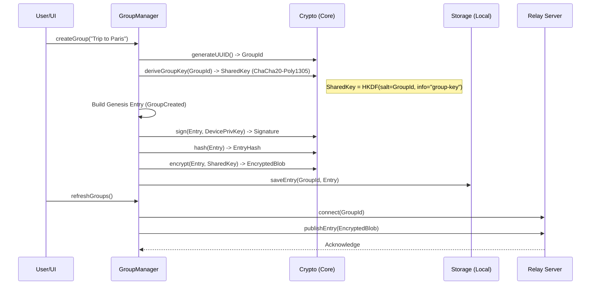

# User Flow: Group Creation

This document details the cryptographic and logical steps taken when a user creates a new group.

## Overview
1.  **Identity Generation**: The user's device generates an Ed25519 key pair if one doesn't exist.
2.  **Group ID Generation**: A unique UUIDv4 is generated.
3.  **Group Key Derivation**: A shared symmetric key is derived from the Group ID.
4.  **Genesis Entry**: The first entry (GroupCreated) is built, signed, and encrypted.
5.  **Local Storage**: The entry is stored locally.
6.  **Relay Synchronization**: The entry is pushed to the Relay server.

## Mermaid Diagram



## Detailed Steps

### 1. Identity
Before any group action, the device must have an identity.
-   `rootKeyPair`: Ed25519 key pair. The `publicKey` is the "User ID".
-   `deviceKeyPair`: Ed25519 key pair (ephemeral or persistent per device).

### 2. Group Key Derivation
To ensure all members can decrypt the ledger without a central authority issuing keys, we derive the **Group Key** deterministically from the **Group ID**.

> **Note**: In a production environment with higher security requirements, we might rotate this key or use a ratcheting mechanism (like Signal). Currently, it's a shared secret derived from the ID, which implies the ID *is* the secret capability to read the group.

```typescript
// Core/src/crypto.ts
const groupKey = hkdf(
    sha256, 
    encoder.encode(groupId), // salt
    encoder.encode(groupId), // ikm
    "splitledger-group-key", // info
    32 // length
);
```

### 3. Genesis Entry
Every group starts with a `GroupCreated` entry. This entry establishes the `chainHash` for subsequent entries (it has no parent, so `previousEntryHash` is null/zero).

**Entry Structure**:
```json
{
    "type": "GroupCreated",
    "payload": { "groupName": "Trip to Paris" },
    "meta": {
        "entryId": "hash-of-content",
        "author": "user-public-key",
        "signature": "ed25519-signature",
        "lamportClock": 0,
        "previousEntryHash": null
    }
}
```

### 4. Synchronization
Once created locally, the group must be synced to the Relay to allow others to find it (via invite).
-   The `SyncManager` connects to the Relay using the `GroupId`.
-   The `Genesis Entry` is encrypted using the `Group Key` and sent to the Relay.
