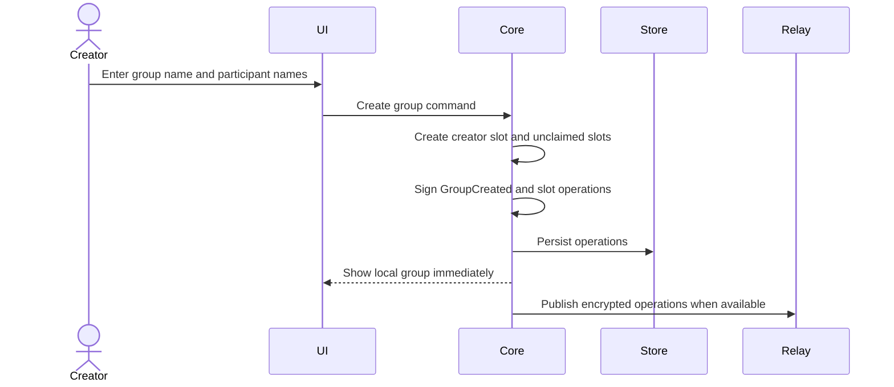

# Group creation flow

## User flow

```mermaid
sequenceDiagram
    actor Creator
    participant UI
    participant Core
    participant Store
    participant Relay
    Creator->>UI: Enter group name and participant names
    UI->>Core: Create group command
    Core->>Core: Create creator slot and unclaimed slots
    Core->>Core: Sign GroupCreated and slot operations
    Core->>Store: Persist operations
    Core-->>UI: Show local group immediately
    Core->>Relay: Publish encrypted operations when available
```

The creator's identity claims the creator participant slot. Other named participants remain unclaimed but can immediately appear in expenses and balances.

## Validation

- Group and participant names meet length limits.
- Participant IDs are random and unique.
- The creator operation has no non-existent parents.
- Later slot operations are signed by the creator's authorized device.
- Relay failure does not roll back local creation.
