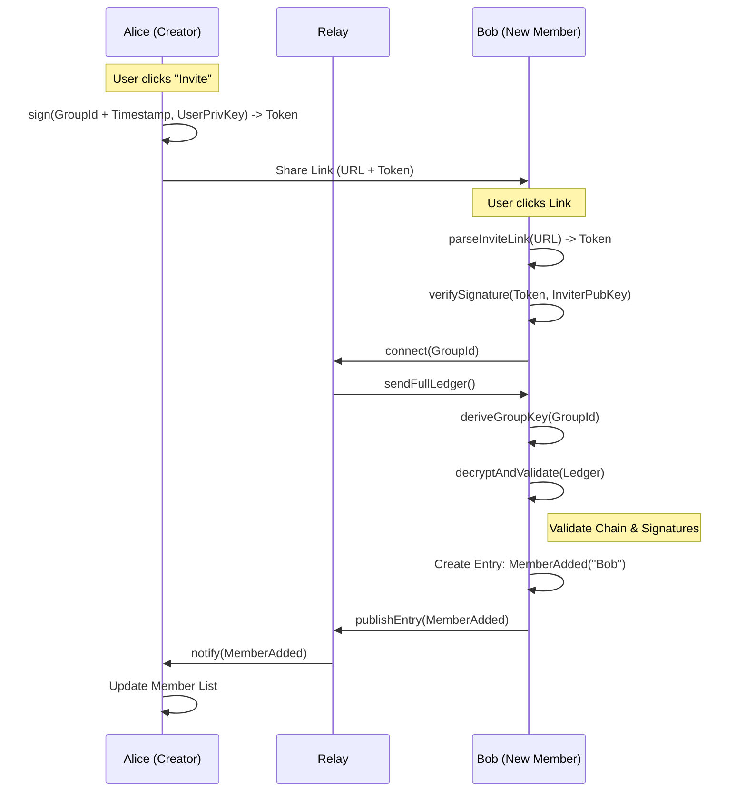

# User Flow: Invitation & Joining

This document explains how users invite others and how new members join a group securely.

## Overview
1.  **Invitation**: Creator generates a signed JWT-like token containing the Group ID and a signature.
2.  **Link Sharing**: The token is embedded in a URL.
3.  **Joining**: New user clicks the link, parses the token, verifies the signature, and derives the group key.
4.  **Member Announcement**: New user publishes a `MemberAdded` entry to the ledger.

## Mermaid Diagram



## Detailed Steps

### 1. Invitation Token
The invitation "token" serves two purposes:
1.  Transmits the `GroupId` (the key to the group).
2.  Prove that the inviter is a valid member/admin.

Structure (Base64 encoded):
```json
{
    "g": "group-uuid",       // Group ID
    "i": "inviter-pubkey",   // Inviter's Identity Key
    "e": 1740000000000,      // Expiration Timestamp
    "s": "signature"         // Sign(g + i + e, InviterPrivKey)
}
```

### 2. Validation
When Bob clicks the link:
1.  **Parse**: Decodes the Base64 token.
2.  **Verify Signature**: Checks `s` against `g + i + e` using `i` (Inviter's Public Key).
3.  **Check Expiry**: Ensures `Date.now() < e`.

### 3. Sync & Store
Bob needs the group history *before* he can append his own "I joined" entry.
1.  **Connect**: Bob's client connects to the Relay for `GroupId`.
2.  **Download**: Fetches all existing entries.
3.  **Derive Key**: `deriveGroupKey(GroupId)` (same mechanism as creator).
4.  **Decrypt**: Decrypts the ledger to verify the `Inviter` is actually a member of this group (check `GroupState`).

### 4. MemberAdded Entry
Once the chain is validated, Bob creates a new entry:
-   **Type**: `MemberAdded`
-   **Payload**: `{ "name": "Bob", "publicKey": "bob-pub-key" }`
-   **Link**: `previousEntryHash` = hash of the last entry Bob downloaded.
-   **Clock**: `lamportClock` = `lastEntry.clock + 1`.

This entry is signed by Bob, encrypted with the Group Key, and pushed to the Relay.
