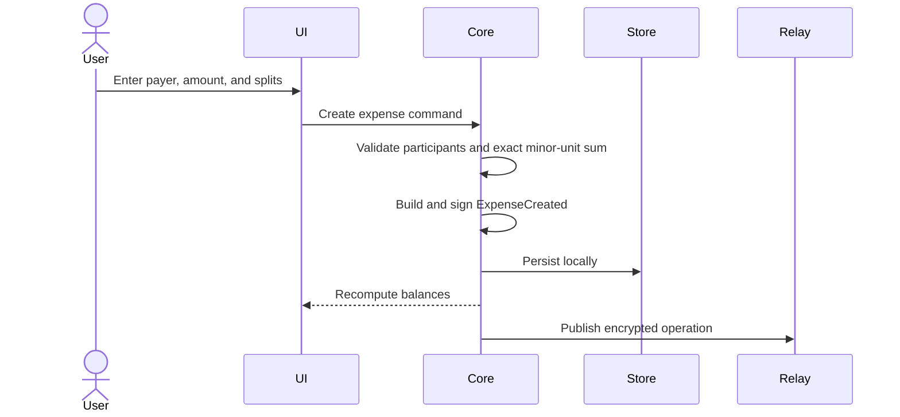

# Expense creation and editing

```mermaid
sequenceDiagram
    actor User
    participant UI
    participant Core
    participant Store
    participant Relay
    User->>UI: Enter payer, amount, and splits
    UI->>Core: Create expense command
    Core->>Core: Validate participants and exact minor-unit sum
    Core->>Core: Build and sign ExpenseCreated
    Core->>Store: Persist locally
    Core-->>UI: Recompute balances
    Core->>Relay: Publish encrypted operation
```

Participants may be claimed or unclaimed active slots. Expenses use stable participant IDs.

## Editing

An edit creates one immutable `ExpenseCorrected` operation with complete replacement data. It does not void and recreate the expense. A deletion creates `ExpenseVoided`. The activity view may show audit history, while balances and totals use the deterministic effective expense.

## Invariants

- Amounts use integer minor units and are positive.
- Splits are non-negative and sum exactly to the amount.
- Payer and split participants exist and are active in the relevant causal state.
- Concurrent corrections follow the protocol's documented deterministic rule.
- Balance sum remains zero.
