# User Flow: Adding an Expense

This document details how an expense is created, cryptographically secured, and added to the tamper-evident ledger.

## Overview
1.  **User Input**: User enters amount, description, and splits.
2.  **Entry Construction**: The system builds the `ExpenseCreated` entry.
3.  **Chaining**: The entry links to the latest known entry (Hash Chain).
4.  **Ordering**: A Lamport Clock is incremented to ensure partial ordering.
5.  **Signing & Hashing**: The entry is hashed and signed by the author.
6.  **Broadcast**: The entry is encrypted and sent to the Relay.

## Mermaid Diagram

```mermaid
sequenceDiagram
    participant User
    participant Logic as App Logic
    participant Ledger
    participant Relay
    
    User->>Logic: Add Expense "Lunch" (10€)
    Logic->>Ledger: getLatestEntry() -> PrevEntry
    
    Logic->>Logic: Clock = max(PrevEntry.clock) + 1
    Logic->>Logic: Entry = { Type: Expense, Data: {...}, Prev: Hash(PrevEntry) }
    
    Logic->>Logic: Hash(Entry) -> EntryId
    Logic->>Logic: Sign(EntryId, PrivKey) -> Signature
    
    Logic->>Ledger: Append(Entry)
    
    Logic->>Logic: Encrypt(Entry, GroupKey) -> Blob
    Logic->>Relay: Publish(Blob)
    
    par Sync to Others
        Relay->>Alice: New Entry (Blob)
        Relay->>Charlie: New Entry (Blob)
    end
```



## Detailed Steps

### 1. The Ledger Entry
An expense entry contains the financial data and the cryptographic metadata.

```typescript
interface ExpenseCreatedPayload {
    description: string;
    amountMinorUnits: number; // e.g., 1000 for 10.00
    currency: string;         // "EUR"
    paidBy: PublicKey;        // Who paid
    splits: {                 // Who owes what
        [publicKey: string]: number 
    };
}
```

### 2. Hash Chaining
To prevent history rewriting (e.g., removing an expense), every entry includes the hash of the previous entry:
`previousEntryHash = SHA256( Serialize(LastEntry) )`

This creates a linked list (Blockchain-lite). If anyone changes an old entry, its hash changes, invalidating all subsequent `previousEntryHash` pointers.

### 3. Lamport Clocks
Since this is a distributed system without a central clock, we use **Lamport Clocks** to determine order and causality.
-   `Entry.clock = LastKnownEntry.clock + 1`
-   When receiving an entry from others, if `remote.clock > local.clock`, we update our local clock.

### 4. Signing
The entire entry (excluding the signature itself) is serialized and signed using the author's **Ed25519 Private Key**.
`Signature = Ed25519_Sign( EntryBytes, PrivateKey )`

This proves **Authenticity** (who wrote it) and **Integrity** (it hasn't been changed).

### 5. Encryption (Privacy)
The ledger is public to the Relay, but the content must be private.
-   We encrypt the serialized entry using **ChaCha20-Poly1305** (AEAD).
-   Key: The shared `Group Key`.
-   Nonce: Generated randomly (or derived from valid inputs).

The Relay sees only:
`{ groupId, encryptedBlob, senderPubkey, lamportClock }`
The Relay *cannot* read the description or amount.
