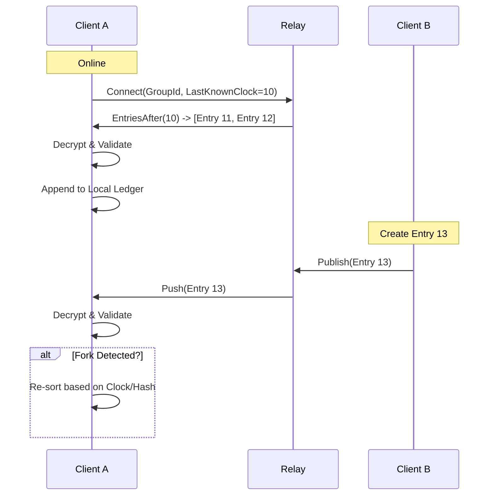

# User Flow: Synchronization

This document explains the synchronization protocol between the client and the Relay server.

## Overview
1.  **Dumb Relay**: The server is a "dumb" store-and-forward relay. It does not validate business logic (e.g., balances). It only validates storage limits and authentication (simple group ID check).
2.  **WebSockets**: Real-time updates are pushed via WebSocket.
3.  **Conflict Resolution**: Handled purely by the clients using the Hash Chain and Lamport Clocks (CRDT-like convergence).

## Mermaid Diagram



## Protocol Details

### 1. Connection
The client opens a WebSocket connection:
`ws://relay.host/ws?groupId=<uuid>`

The Relay subscribes this socket to the "room" identified by `groupId`.

### 2. Pulling Missing Data (`GET_ENTRIES_AFTER`)
On connection, the client sends its `currentLamportClock`.
The Relay queries its database: `SELECT * FROM entries WHERE group_id = ? AND lamport_clock > ?`.
It returns the missing encrypted blobs.

### 3. Pushing New Data (`PUBLISH_ENTRY`)
When a client creates an entry, it sends:
```json
{
    "type": "PUBLISH_ENTRY",
    "groupId": "...",
    "lamportClock": 15,
    "encryptedEntry": "base64...",
    "senderPubkey": "..."
}
```

The Relay:
1.  Checks storage limits (Max entries per group, max size).
2.  Stores the blob.
3.  Broadcasts `NEW_ENTRY` to all other connected clients in the room.

### 4. Conflict Handling
What if Alice and Bob both create Entry #5 at the same time?
-   Both entries will have `previousEntryHash` pointing to Entry #4.
-   Both might have `lamportClock = 5`.

**Resolution (Client-Side)**:
1.  Clients receive both entries.
2.  The ledger is linearized deterministically:
    -   Sort by `lamportClock` (primary).
    -   Sort by `entryHash` (secondary, tie-breaker).
3.  Since the hash is unique and immutable, all clients eventually agree on the exact same order of events (Strong Eventual Consistency).
