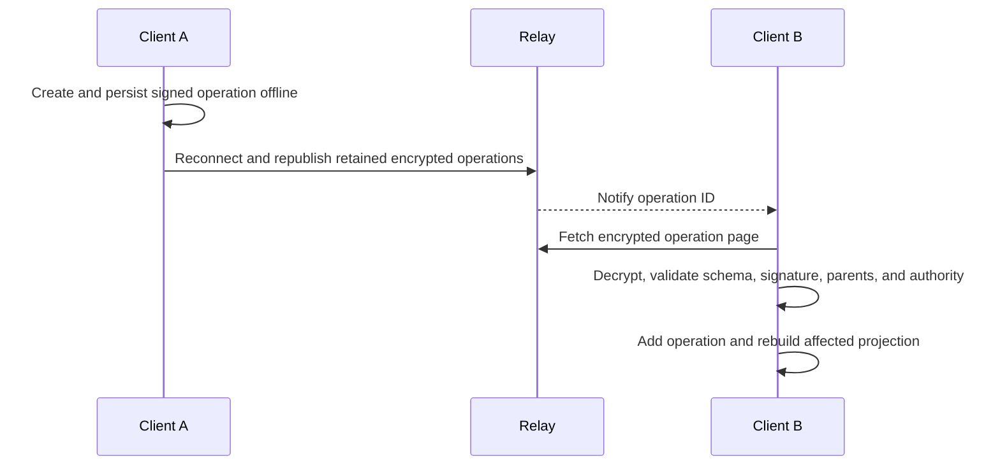

# Synchronization flow

```mermaid
sequenceDiagram
    participant A as Client A
    participant Relay
    participant B as Client B
    A->>A: Create and persist signed operation offline
    A->>Relay: Reconnect and republish retained encrypted operations
    Relay-->>B: Notify operation ID
    B->>Relay: Fetch encrypted operation page
    B->>B: Decrypt, validate schema, signature, parents, and authority
    B->>B: Add operation and rebuild affected projection
```

Clients exchange operation sets rather than a supposedly linear chain. Concurrent branches are normal. Relay delivery order is not trusted and duplicate publication is harmless.

## Failure behavior

- Unavailable relay: retain local operations and retry with bounded backoff.
- Missing parents: request ancestors and defer the child.
- Invalid ciphertext or signature: reject without changing state.
- Unsupported protocol: stop group application and show an upgrade requirement.
- Relay omission: another relay or peer backup may restore availability, but the protocol cannot force a malicious relay to serve data.
- Empty or replaced relay: an online member republishes its retained operation set.
- Required history unavailable: keep known local state and show that another member with the missing history needs to come online.

The relay is not required for viewing or changing an already-local group. It is a temporary rendezvous point when independently stored device histories need to exchange operations.
