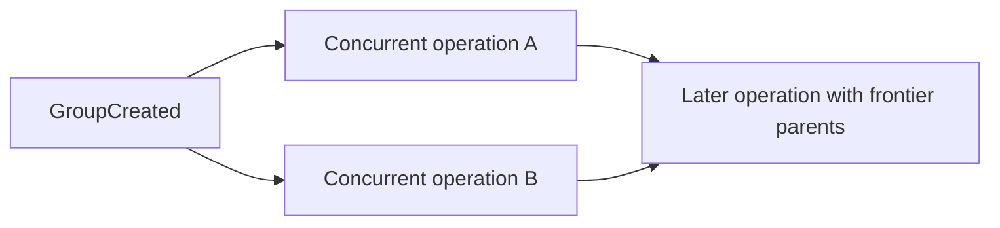
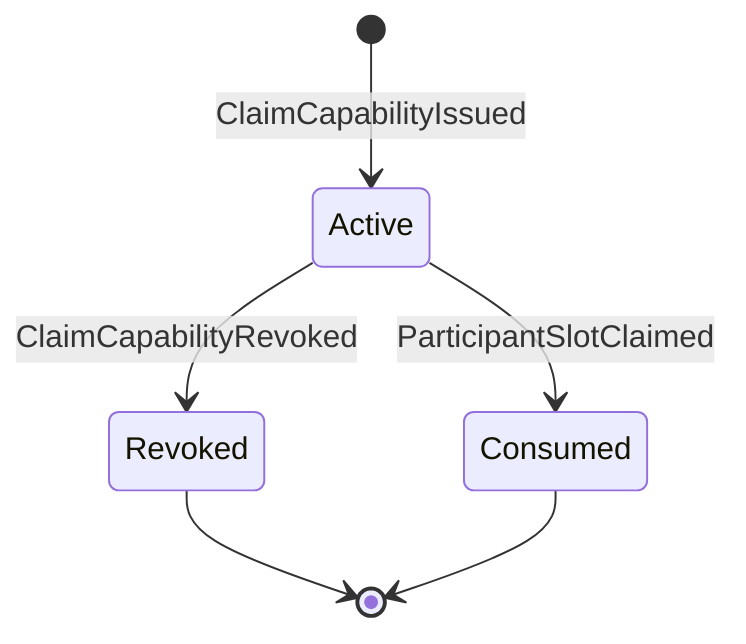

# Fair Money protocol v2 draft

Status: normative draft for implementation and interoperability testing.

The keywords MUST, MUST NOT, REQUIRED, SHOULD, SHOULD NOT, and MAY are normative.

## Encodings and identifiers

- JSON objects MUST be serialized with RFC 8785 JSON Canonicalization Scheme and UTF-8.
- Integers MUST be within JavaScript's safe integer range. Floating-point amounts are forbidden.
- Public keys, signatures, operation IDs, and commitments MUST be lowercase hexadecimal.
- Group, participant, capability, expense, and device IDs MUST be lowercase UUID strings.
- Parent arrays MUST be sorted lexicographically, contain no duplicates, and contain only the current known frontier.
- Unknown fields MUST be rejected in protocol v2 signed objects.

## Signed operation

An unsigned operation contains exactly:

```ts
interface UnsignedOperation {
  protocolVersion: 2;
  groupId: string;
  parents: string[];
  lamportClock: number;
  createdAt: number;
  actorPublicKey: string;
  payload: OperationPayload;
}
```

The operation ID is lowercase hexadecimal SHA-256 of the RFC 8785 bytes. The Ed25519 signing message is the UTF-8 string `fair-money:v2:operation:<operationId>`. A transmitted operation adds exactly `operationId` and `signature`.

`GroupCreated` MUST have no parents and clock zero. Every other operation MUST have at least one parent and its clock MUST equal one plus the maximum parent clock. `createdAt` is advisory and MUST NOT determine authorization. `GroupCreated.expenseEditPolicy` fixes edit authorization for the lifetime of the group; when omitted it is `collaborative`.

## Operation graph and replay



Clients validate parents before children. A deterministic topological order uses `(lamportClock ascending, operationId ascending)` for simultaneously eligible operations. The graph, rather than this presentation order, determines causality.

Two operations are concurrent when neither is an ancestor of the other. Clients MUST retain valid concurrent operations.

Projection inputs are operations that have already passed schema, hash, signature, causal, and authorization validation. Projection conflict rules MUST NOT turn an invalid operation into an accepted one.

## Participant slots

`GroupCreated` creates and claims the creator slot for the root key that signed it. Expenses refer to participant IDs, never keys.

The initial creator-only administrative policy is:

- Only the creator root or its authorized devices may create, rename, disable, or reset slots.
- Only the creator may issue or revoke claim capabilities.
- A slot claim requires an active capability secret and a claimant root signature. A targeted capability fixes the slot; an `any-unclaimed-slot` capability permits one currently unclaimed slot selected in the claim.
- A reset removes the old key binding prospectively; it never changes historical expenses.
- A reset invalidates all earlier claim capabilities for that slot; a replacement invite MUST use a capability issued after the reset.

Creator-only reset is provisional until the product owner explicitly confirms whether additional approval is required.

## Claim capability lifecycle



The capability secret is 32 random bytes encoded as unpadded base64url in the invite. The signed issue operation stores `SHA-256(secretBytes)`, not the secret. Claim proof hashes the decoded secret and compares it in constant time.

An optional `displayExpiresAt` is advisory metadata for user interfaces and relay retention only. It MUST NOT determine ledger authorization: an offline protocol without a trusted clock cannot make wall-clock expiry deterministic, and `createdAt` is actor-controlled. The creator invalidates an unused invite with `ClaimCapabilityRevoked`. A future trusted-time design requires a separate protocol revision.

A claim MUST causally descend from its issue and MUST NOT causally descend from a revocation. A claim concurrent with a revocation may still win; reissuance cannot prevent a stolen old link used before revocation is observed. Concurrent valid claims for one slot are resolved by the lowest `(lamportClock, operationId)`. Losing claims remain in audit history but do not bind the slot.

## Authorization

| Payload | Required actor and causal conditions |
|---|---|
| `GroupCreated` | Creator root key; unique root operation |
| `ParticipantSlotCreated` | Creator-authorized key; unique participant ID |
| `ParticipantSlotRenamed` | Creator-authorized key; active slot exists |
| `ParticipantSlotDisabled` | Creator-authorized key; creator slot cannot be disabled |
| `ClaimCapabilityIssued` | Creator-authorized key; targeted slot or at least one generic candidate is unclaimed |
| `ClaimCapabilityRevoked` | Creator-authorized key; capability is active in causal state |
| `ParticipantSlotClaimed` | Claimant root key plus a valid targeted or generic capability proof |
| `ParticipantSlotReset` | Creator-authorized key; target is claimed and not creator |
| `ExpenseCreated` | Authorized device of an active claimed participant |
| `ExpenseCorrected` | Any active claimed participant device, provisionally |
| `ExpenseVoided` | Any active claimed participant device, provisionally |
| `SettlementCreated` | Authorized device of the paying participant |
| `DeviceAuthorized` | Owning root key |
| `DeviceRevoked` | Owning root key or another already authorized owner device |

The product default remains provisional, but each group's selected policy is signed into `GroupCreated` so clients cannot diverge through local configuration.

## Expense projection

- Expense IDs are stable UUIDs supplied by `ExpenseCreated` and unique within a group.
- Corrections and voids reference the original expense ID directly.
- Among concurrent or sequential corrections, the greatest `(lamportClock, operationId)` is effective.
- Any accepted void makes the expense void. Protocol v2 has no unvoid operation.
- If projection metadata exposes one representative among multiple accepted voids, it uses the lowest `(lamportClock, operationId)`; this does not change the permanent void status.
- Corrections after a causally known void are invalid.
- Payer and every split participant MUST exist and be active in causal state.
- Shares MUST be non-negative safe integers whose sum equals the positive amount.
- Currency MUST be one uppercase ISO-style three-letter code; mixed-currency balance presentation is per currency.

## Device rules

Root keys identify people; device keys sign routine operations. Device authorization is scoped to one root identity. Revocation applies prospectively in causal state and cannot invalidate historically valid operations. A revoked device public key MUST NOT be authorized again; enrollment uses a new device key.

## Relay namespace admission

Relay capabilities authorize access to an existing opaque namespace but do not prove that a new namespace was created by Fair Money. When a relay responds with `ADMISSION_REQUIRED`, the client computes the announced leading-zero-bit SHA-256 proof over the versioned admission domain, group UUID, group capability, and hexadecimal nonce, then retries the rejected message with that nonce. The proof is required only while the namespace is unknown to that relay. It is an allocation-abuse control, not a group operation, identity credential, or content-validity proof.

## Encrypted invitation package

The canonical invitation URL is `https://<join-domain>/invite/<ciphertext>#key=<decryption-key>`.

- `<ciphertext>` is unpadded base64url of a 12-byte nonce followed by AES-256-GCM ciphertext and its authentication tag.
- `<decryption-key>` is an independent random 32-byte AES key encoded as 43-character unpadded base64url.
- The authenticated additional data is the UTF-8 string `fair-money:v2:invite`.
- The decrypted bytes are RFC 8785 canonical JSON conforming to `invite.schema.json`.
- The join host receives the ciphertext path but browsers do not send the fragment key in HTTP requests.
- Clients MUST preserve the fragment across cold start, warm start, copy/paste, and platform-link delivery.
- A missing fragment, authentication failure, unknown field, insecure join URL, or non-HTTPS/WSS relay URL MUST fail closed.

The package contains the relay address and opaque relay-group capability, group encryption secret, capability scope and ID, claim secret, and issuing operation ID. A targeted package also contains its participant ID; a generic package omits it. `displayExpiresAt` remains advisory. After synchronization, the client MUST verify that the referenced issue operation matches the capability scope, optional target, ID, and SHA-256 commitment before publishing a claim. For a generic invite, the client presents currently unclaimed slots and includes the recipient's selection in the signed claim.

Fragment removal by a messenger or copy operation makes the link unusable but does not reveal its contents. The landing page therefore also needs an explicit full-link/code copy fallback.

## Versioning

- Protocol v2 signed objects use `protocolVersion: 2`; relay envelope versioning is separate.
- This pre-release project has no v1 compatibility requirement. Protocol-v2 clients reject and do not migrate v1 history.
- Superseded pre-release formats and implementations are deleted rather than maintained alongside v2.
- Unsupported major versions MUST fail closed with an upgrade-required state.

## Files

- [Operation JSON Schema](operation.schema.json)
- [Decrypted invitation JSON Schema](invite.schema.json)
- [Canonicalization and signature vectors](test-vectors.json)
- [Projection and conflict vectors](projection-vectors.json)
